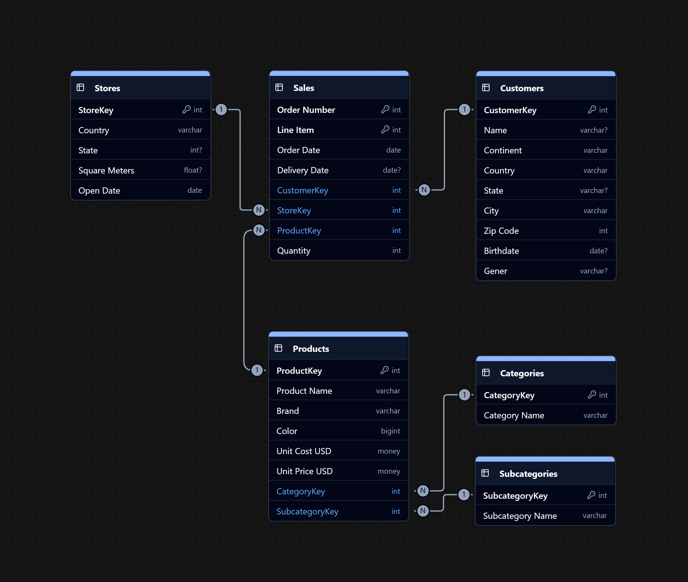

# Project Background
SmartPick Electronics is a global omni-channel retailer that sells a wide variety of household electronics via its website and store fronts.

Insights and recommendations are provided on the following key areas:

- **Sales Trends:** Evalutaion of historical sales patterns across categories and countries, with a focus on Revenue, Order Volume, and Average Order Value (AOV).
- **Product Performance:** Evaluation of product diversity and sales impact across time and regions with a focus on Revenue and Product Mix

An interactive Tableau dashboard used to report and explore sales trends can be found [here](https://public.tableau.com/app/profile/myckaell.silva5351/viz/SmartPick/Dashboard1).

# Data Structure & Initial Checks

The companies main database structure as seen below consists of four tables: Sales, Products, Categories, Subcategories, Customers, and Stores with a total row count of 67,448 records. A description of each table is as follows:
- **Sales:** The main table that holds transactional data.
- **Products:** A list of all products sold and their details
- **Categories/Subcategories:** A list of classifications for products
- **Customers:** Detailed information on customers that can be used for segmentation
- **Stores:** Details about the stores' physical attributes

# Executive Summary

### Overview of Findings

After a significant rise in sales early 2020, the company's sales have continued to decline since. Order count and revenue decreased by 49% from 2019, while Average Order Value (AOV) had a a less significant decline rate of -4%. While the largest portion in the decline of sales can be attributed to COVID-19, we will explore additional contributing factors.

[Visualization, including a graph of overall trends or snapshot of a dashboard]

# Insights Deep Dive
### Sales Trends

* There are consistent seasonal peaks sales. The **peaks are between December and February** often accounting for 60% of the total year's revenue.

* There are also consistent seasonal dips in sales. The **dips occur between April and June** and have contributed less than 2% of sales in past years.

* **Order count highly influences total revenue** as AOV is fairly steady with an average of 2% fluctuation across the years. Order count is highly reflective of total revenue.

* **The United States peaked at 63% of total sales** across 8 different countries. The US is consistently contributing more than 40% of total sales year-round.

[Visualization specific to category 1]

### Product Performance:

* **Computers and Home Appliances contribute over 50% of total revenue.** In further detail, the top products in revenue are dominated by the Computers category.
  
* **Games and Toys are the weakest products offered.** They contribute less than 2% of total revenue. Music/Movies and Audio follow suit contributing 6% of total sales each.

* Home Appliances and TV/Video have not shown in increase or decrease in order count despite bringing in 30% of total revenue combined. Order count did drop along with all other products in early 2020.

* Categories such as Music/Movies, Games and Toys, and Audio account for a respectable +36% of total orders collectively, however, the total amount contributed to revenue is below expected with a combined total of 11%.

[Visualization specific to category 2]

# Recommendations:

Based on the insights and findings above, we would recommend the [stakeholder team] to consider the following: 

* With Computers and Home Appliances accounting for over 50% of total revenue, diversifying the product portfolio is necessary to survive a volatile market. **Expanding products to compliment high performing categories can increase AOV and customer retention.**

* Since the primary factor for the large dip in sales in 2020 can be attributed to COVID-19, the company should take this opportunity to **compare customer segments pre and post pandemic to develop a recovery strategy utilizing the current structure and creating room for change.**

* **Re-evaluate low performing categories (Music/Movies, Games and Toys, and Audio).** They create a fair amount of orders, but the revenue does not match up. The overhead costs might outweigh the benefits of continuing these products.

* With the US contributing the majority of the sales, **distribution across other countries should be reassessed.** The UK and Germany have been the highest contributors after the US.

* To adjust for the seasonal trend, **a loyalty program should be introduced and highly utilized during April** to promote more orders. The company can also capitalize the natural peaks and use **advertising during the holiday season to draw in more customers.**

* Growth in revenue is highly attributed to order count as AOV is steady. We should **implement a way to track how customers are acquired to capitalize and reassess different marketing channels.** We can then work on how to increase total order count.

# Assumptions and Caveats:

Throughout the analysis, multiple assumptions were made to manage challenges with the data. These assumptions and caveats are noted below:

* Data stops at 2021, more relevant data may be available but not provided
